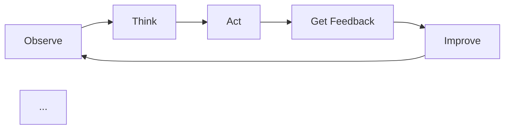

  # 👋 Hi, I'm Aman Murari Singh

AI Engineer | AI Research Enthusiast | LLMs | AI Agents | Reinforcement Learning

 

---

🚀 About Me

I am an AI Engineer and AI Research enthusiast with 1+ years of hands-on experience in building AI systems, LLM projects, AI agents, and real-world AI products.

My focus is simple:

«Build AI systems where research meets practical products.»

- 🔬 Former Paid AI Research Intern at Vizuara
- 💼 Former AI Engineer
- 🧠 Worked on AI research using the latest OpenAI GPT-OSS model
- 🌟 Built open-source AI work with 100+ GitHub stars and 30+ forks
- 🤖 Interested in LLMs, AI Agents, Reinforcement Learning, and Human-like AI learning

---

🧠 Research Work

nano-gpt-oss

During my AI Research Internship at Vizuara, I worked on research problems around the latest OpenAI GPT-OSS model.

I published the open-source repository:

🔗 Repository: [VizuaraAILabs/nano-gpt-oss](https://github.com/VizuaraAILabs/nano-gpt-oss)

 | Metric | Impact |
  | --- | --- |
| ⭐ GitHub Stars | 100+ |
| 🍴 Forks | 30+ |
| 🧪 Domain | LLM Research |
| 🌍 Type | Open Source |
| 🛠️ Focus | Model Architecture & Training |

This project helped me understand how research ideas can be implemented, tested, and shared with the AI community.

---

🏆 Featured Project

Excel AI Agent

At DoubtBuddy, I shipped an Excel AI Agent that runs inside Microsoft Excel.

The problem was that many users spend a lot of time doing manual work in Excel, such as cleaning data, analyzing data, creating charts, making reports, and extracting data from PDFs or websites.

The AI Agent helps users:

- 📊 Analyze data automatically
- 🧹 Clean messy data
- 🧠 Perform feature engineering
- 📈 Create charts and visualizations
- 📝 Generate automatic reports
- 📄 Extract data from PDFs
- 🌐 Extract data from web pages
- ⚡ Work directly inside Microsoft Excel

Excel + AI Agent = Faster Data Analysis, Cleaning, Visualization, and Reporting

This project is special because it was not just a demo. It was a real AI product built for real users and real workflows.

---

🛠️ Tech Stack

AI / ML

 Tools & Frameworks

---

🔬 Research Interests

I am deeply interested in building AI that can learn like humans.

Most AI systems learn from fixed data. Humans learn by trying, making mistakes, taking feedback, and improving.

My long-term goal is to build AI agents that can:

Areas I Care About

- Large Language Models
- AI Agents
- Reinforcement Learning
- Human-like learning
- AI systems that learn from feedback
- AI for real digital and physical environments

---

📊 GitHub Stats

 

---

🌱 What I Want To Build

I want to build research-driven AI systems from India.

My dream is to work on AI agents that can:

- Learn from real feedback
- Improve through experience
- Reason before taking action
- Help people in real-world work
- Move beyond only answering questions
- Work in both digital and physical environments

---

💡 My Belief

«Good AI research should not stay only in papers.
It should become useful systems that solve real problems.»

---

🤝 Connect With Me

---

Thanks for visiting my profile 🚀

🌱 What I Want To Build

I want to build research-driven AI systems from India.

My dream is to work on AI agents that can:

- Learn from real feedback
- Improve through experience
- Reason before taking action
- Help people in real-world work
- Move beyond only answering questions

---

💡 My Belief

«Good AI research should not stay only in papers.
It should become useful systems that solve real problems.»

---

🤝 Connect With Me

---
